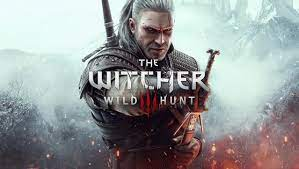
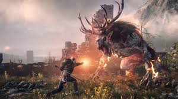
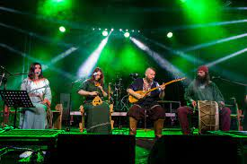
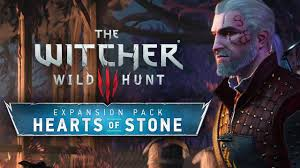
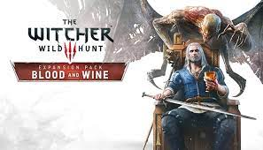

# the Witcher

## Résumé

The Witcher 3: Wild Hunt (en polonais : Wiedźmin 3: Dziki Gon) est un jeu vidéo de type action-RPG développé par le studio polonais CD Projekt RED, sorti le 19 mai 2015 sur PC (Microsoft Windows et GNU/Linux1), PlayStation 4 et Xbox One, puis sur Nintendo Switch le 15 octobre 2019, tandis que des versions PlayStation 5 et Xbox Series sont disponibles le 14 décembre 2022. Il fait suite narrativement à The Witcher (2007) et The Witcher 2: Assassins of Kings (2011). Il est ainsi le troisième jeu vidéo à prendre place dans l'univers littéraire du Sorceleur, créé par l'écrivain polonais Andrzej Sapkowski, et le dernier à présenter les aventures de Geralt de Riv.

Le jeu, situé dans un monde dark fantasy, suit les traces du sorceleur Geralt de Riv, un chasseur de monstres dont la fille adoptive, Ciri, est menacée par la Chasse sauvage. Des références sont faites au contenu des livres écrits par Sapkowski, mais l'intrigue est inédite et propose une conclusion à la trilogie entamée avec le premier jeu, sorti huit ans plus tôt. Contrairement aux deux autres opus de la série, The Witcher 3 prend place dans un monde ouvert en usant d'un point de vue à la troisième personne, et se concentre sur l'utilisation des talents de combat et de détective de Geralt pour mener à bien des contrats et explorer l'environnement. Le tout se déroule dans le cadre d'une quête principale à plusieurs embranchements, qui peut se résoudre selon 36 fins différentes, et d'une multitude de missions secondaires.

## Style de jeu

The Witcher 3: Wild Hunt est un jeu vidéo de type action-RPG avec un point de vue à la troisième personne. Le joueur incarne le sorceleur Geralt de Riv, un chasseur de monstres mandaté par des personnages non-joueurs pour les débarrasser de nuisibles ; la composition de ce bestiaire fait appel à plusieurs mythologies, au folklore d'Europe de l'Est ou encore à des références plus ésotériques9. En plus de courir et de combattre à l'aide d'armes et de sorts, Geralt est capable pour la première fois dans la série de chevaucher, de sauter, d'enjamber ou de grimper sur des obstacles, de s'accrocher à des rebords, de nager et de naviguer sur des esquifs.

Son arsenal de combat comprend des bombes disposant d'effets variés, une arbalète et en particulier deux épées, l'une en acier et l'autre en argent, chacune faisant respectivement davantage de dégâts sur les humains et sur les monstres12. En situation de combat, Geralt peut choisir d'asséner des coups lourds mais lents, ou bien de lancer des attaques plus rapides mais causant moins de dommages ; il lui est aussi possible d'esquiver ou de parer les coups adverses. Cependant, chaque utilisation diminue l'efficacité de l'arme, qui doit être réparée régulièrement chez un forgeron13. En plus des attaques physiques, Geralt dispose de cinq signes magiques qu'il peut déclencher dans un conflit : Aard, Axii, Igni, Quen et Yrden. Aard déclenche un souffle télékinétique qui déstabilise les ennemis ou repousse les obstacles ; Axii engendre la confusion chez ses victimes, qui ne reconnaissent plus leur propre camp, et hors d'une situation de combat permet de convaincre un personnage d'effectuer une certaine action ; Igni déclenche un souffle de feu ; Quen enveloppe Geralt d'une coquille protectrice qui absorbe les dégâts ; et Yrden pose aux pieds de Geralt un piège pour affaiblir ses ennemis. Ces signes magiques puisent dans l'endurance de Geralt, qui se mesure au moyen d'une jauge située à proximité de la barre de vie14. Les pouvoirs magiques de Geralt peuvent être renforcés par l'usage de « mutagènes », des mutations propres aux sorceleurs qui viennent soutenir ses compétences naturelles. La santé de Geralt diminue quant à elle lorsqu'il reçoit des dégâts, mais peut se restaurer en utilisant des aliments ou des potions ou bien en méditant. La puissance des dégâts et la protection de Geralt sont influencées par l'équipement qu'il porte, qui peut notamment être personnalisé avec des teintures disponibles dans l'extension Blood and Wine.

## Bande son immersive

La bande-son du jeu est accueillie très favorablement par les critiques et se distingue par son fort usage de sons et de chants slaves, parfois à base de lamentations de femmes, notamment dans les thèmes accompagnant les phases de combat45. Elle est enregistrée à Francfort-sur-l'Oder par le Brandenburg State Orchestra sous la direction de Bernd Ruf46. Les sons de bataille, de canons, de flèches décochées, le cliquetis des troupes marchant en armure et d'un forgeron à l'œuvre sont introuvables dans les bibliothèques de sons et sont donc captés lors d'une reconstitution de la bataille de Grunwald. Pour refléter l'écho et le bruit étouffé des heaumes sur la voix des soldats et plutôt que de maquiller le son avec des égaliseurs, leurs dialogues sont enregistrés en déposant un casque sur le micro. Les sons plus précis d'une épée sortie de son fourreau, de gravier, ou d'étoffe de vêtement que l'on effleure sont enregistrés en studio. Les bruits ambiants accompagnant Geralt lorsque celui-ci chevauche Ablette ou traverse une rivière, quant à eux, varient selon la météorologie et sont par exemple atténués si une tempête fait rage ou si le vent souffle. L'équipe son a à cœur de proposer une expérience authentique, « brutale, crue, et capable de faire frissonner tout entier à l'écoute »

## Extensions

### Heart of stone

*chanson :*
*Son visage est doux, ses mots vous ensorcellent
L’engeance du démon n’en est pas moins cruelle.
Il exaucera vos vœux les plus ardents,
Vous couvrira d’argent, d’or et de diamants.
Le prix à payer est un grand sacrifice ;
Une vie de peines, de souffrances et de vices,
Votre raison, votre âme et vos tourments
Lui appartiendront jusqu’à la fin des temps.*

L'extension suit Geralt de Riv rentrant en contact avec un mystérieux homme connu sous le nom de Gaunter de Meuré, déjà rencontré dans Wild Hunt, et ses connections avec Olgierd von Everec, un noble maudit.

### Blood & wine

Plusieurs années après les événements de Wild Hunt, Geralt se voit proposer un contrat par la duchesse Anna Henrietta, la souveraine de Toussaint. Deux chevaliers ont été assassinés et Geralt doit trouver ainsi que tuer le monstre responsable.

L'extension comporte également la chanson Lullaby of Woe, composée par Marcin Przybyłowicz. 
On y trouve également de nombreuses références aux contes de fées :

- Jack et le Haricot magique
- Le Garçon qui criait au loup 
- Raiponce 
- Le Petit Chaperon rouge
- Les Trois Petits Cochons
- Boucles d'or et les Trois Ours 
- La Petite Fille aux allumettes
- Hansel et Gretel
- La Petite Poucette
- Les Musiciens de Blaviken
